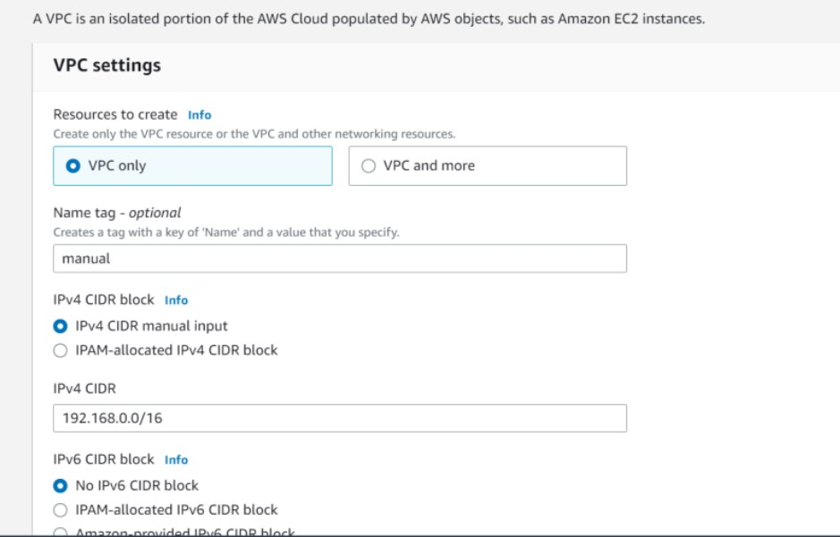
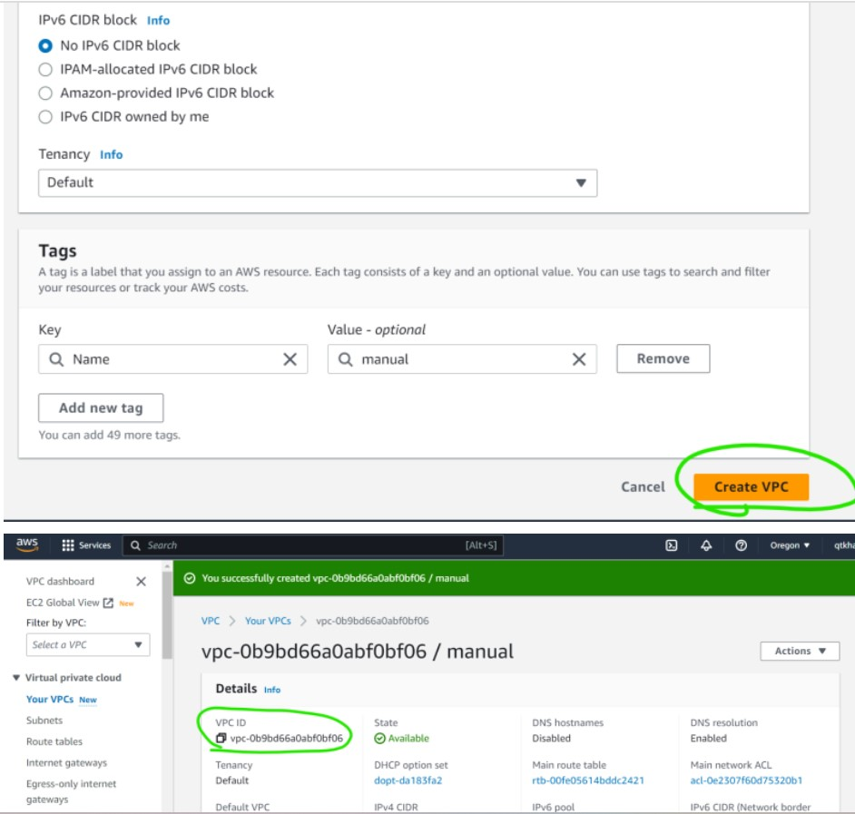
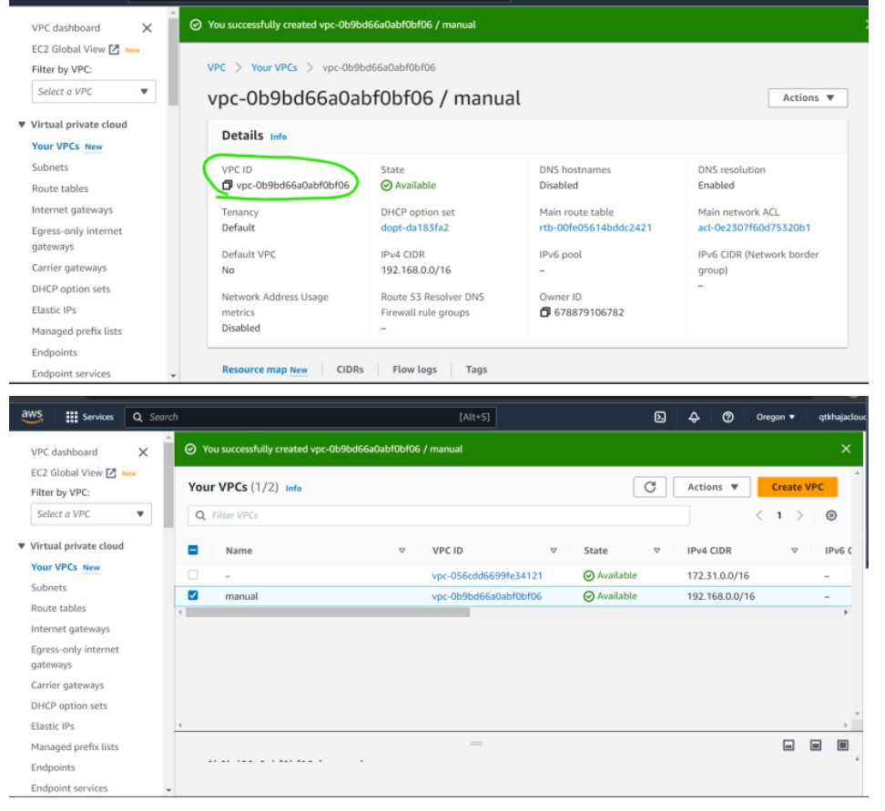
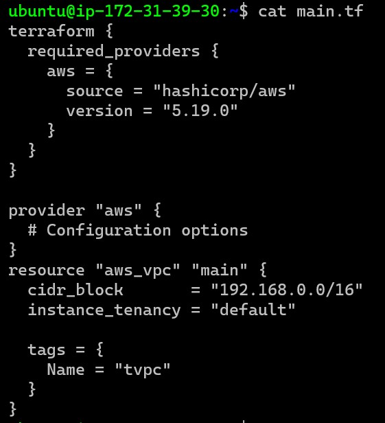
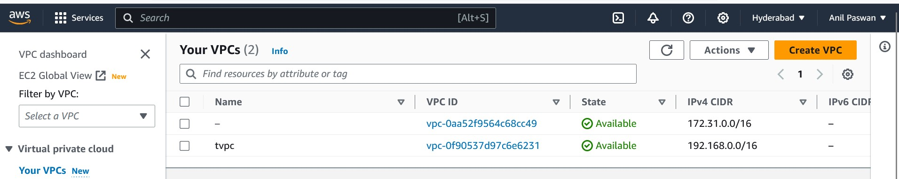

# terraform2

###### DAY 4
```wget -O- https://apt.releases.hashicorp.com/gpg | sudo gpg --dearmor -o /usr/share/keyrings/hashicorp-archive-keyring.gpg
echo "deb [signed-by=/usr/share/keyrings/hashicorp-archive-keyring.gpg] https://apt.releases.hashicorp.com $(lsb_release -cs) main" | sudo tee /etc/apt/sources.list.d/hashicorp.list
sudo apt update && sudo apt install terraform
```
## Azure Provider
@https://registry.terraform.io/providers/hashicorp/azurerm/latest/docs
* To install azure cli @https://learn.microsoft.com/en-us/cli/azure/install-azure-cli-linux?pivots=apt#option-1-install-with-one-command To authenticate azure cli
```
az login
az group list
```
#### Providers and resources
* In terraform to create any resource we need to configure provdier
* Every provider has a specific structure 
```
provider "<name>" {
    <ARGUMENT-1> = <VALUE-1>
    ..
    ..
    ..
    <ARGUMENT-N> = <VALUE-N>

}
```
* AWS Provider argument reference @https://registry.terraform.io/providers/hashicorp/aws/latest/docs#argument-reference
* Azure Provider argument reference https://registry.terraform.io/providers/hashicorp/azurerm/latest/docs#argument-reference
* Resource: The syntax or structure of resource in terraform template is
```
resource <type of resource> <name> {
    <ARGUMENT-1> = <VALUE-1>
    ..
    ..
    ..
    <ARGUMENT-N> = <VALUE-N>
}
```
* the type of resource will be in the form of ``<provider>_<resource_type>``
* ### Manual Steps of VPC Creation
* Steps: Lets create a simple vpc
* 
* 
* 
* 
* Lets search for resource which lead to @https://registry.terraform.io/providers/hashicorp/aws/latest/docs/resources/vpc
* Now look at arguments @https://registry.terraform.io/providers/hashicorp/aws/latest/docs/resources/vpc#argument-reference
* Create the template as shown in this changeset @https://github.com/asquarezone/TerraformZone/commit/a1465ed6f0ec27f6f644236eb4fce0b342d59e7f      
* ### OR
* 
* Now validate and apply
*  
* ### i am going to stop for few days..., sorry for the inconvenience...
  